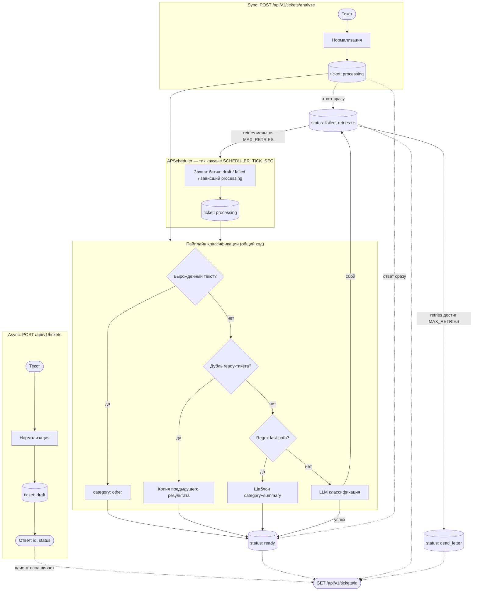

# test_monolith — AI-агент для обработки текстовых обращений

*Монолит · Кейс 1*

Микросервис для агентства недвижимости: принимает текстовое обращение клиента, классифицирует тип запроса,
кратко резюмирует содержание и возвращает структурированный результат. Классификация — гибридная: дешёвая
эвристика для простых однозначных случаев, LLM — когда нужно разобраться в свободном тексте.

## Что сделано

Реализовано как самостоятельный микросервис (FastAPI + async SQLAlchemy + Alembic + Unit of Work),
поднятый быстро за счёт уже готового личного каркаса — типовая инфраструктура (логирование, healthcheck,
обработка ошибок, docker-compose) переиспользована, а не написана с нуля, что позволило сосредоточить
время на бизнес-логике самой задачи.

- FastAPI-микросервис, полностью асинхронный (SQLAlchemy async + asyncpg)
- Гибридная классификация: дешёвая эвристика (regex) как first-pass, LLM — когда нужна семантика текста
- Универсальный AI-клиент: работает с любым OpenAI-совместимым провайдером (Mistral / DeepSeek / OpenAI) —
  адрес и ключ задаются через `.env`, без переключения кода
- Две ручки обработки обращения:
  - `POST /api/v1/tickets/analyze` — синхронная, сразу отдаёт структурированный JSON
  - `POST /api/v1/tickets` + `GET /api/v1/tickets/{id}` — асинхронная, с сохранением в Postgres и статусами
    (`draft` → `processing` → `ready`/`failed`), обработка — фоновым планировщиком (APScheduler)
- Дедупликация: если нормализованный текст точно совпадает с уже обработанным `ready`-тикетом — копируем
  готовый результат, LLM не вызываем повторно (сама запись в БД всё равно сохраняется — история обращений)
- Regex fast-path: короткий текст с одним однозначным ключевым словом классифицируется по шаблону,
  без обращения к LLM (осознанное ограничение — учитывает только точные словоформы, без морфологии)
- Admin-ручка с расширенным ответом (технические метаданные: токены, время обработки, ретраи)
- `docker-compose up --build` — поднимает сервис и Postgres одной командой
- Docker-образ собирается по multi-stage принципу (builder ставит зависимости, runtime забирает только
  готовое окружение и код приложения) — образ легче, без лишних build-инструментов в финальном слое
- Миграции Alembic применяются автоматически при старте контейнера (`alembic upgrade head` перед запуском
  uvicorn) — не нужно катить их вручную

### Почему две ручки, и как работают ретраи

**Sync (`POST /api/v1/tickets/analyze`)** — ближе к буквальной формулировке задачи: текст → сразу
структурированный ответ. Удобно для прямой демонстрации и для клиентов, готовых подождать один LLM-вызов
в реальном времени.

**Async (`POST /api/v1/tickets` + `GET /api/v1/tickets/{id}`)** — не блокирует вызывающего на время LLM-вызова
(который может быть медленным или временно недоступным): ответ `{id, status}` возвращается сразу, а
классификация происходит в фоне. Более реалистичный контракт для контакт-центра с реальной нагрузкой,
где отправитель не обязан ждать ответ LLM синхронно.

**Ретраи — общий механизм для обеих веток.** У тикета один и тот же счётчик `retries`, не два разных пути:

- Если LLM-вызов внутри sync-запроса не удался — ретраить его тут же, растягивая HTTP-запрос, не имеет
  смысла: тикет сразу помечается `failed` (retries = 1) и в этот момент фактически "падает" в то же
  состояние, что и async-тикет после неудачной попытки — дальше его подхватывает тот же планировщик.
- Планировщик (APScheduler) каждые `SCHEDULER_TICK_SEC` секунд (по умолчанию 5) атомарно забирает батч
  тикетов со статусом `draft`/`failed`, либо "зависший" `processing` (процесс упал посреди обработки,
  тикет не обновлялся дольше `PROCESSING_TIMEOUT_SEC`) — через `UPDATE ... FOR UPDATE SKIP LOCKED`, чтобы
  тикет не мог быть захвачен дважды, даже если бы планировщиков было несколько.
- При неудачной попытке `retries` увеличивается; как только достигнут `MAX_RETRIES` (по умолчанию 3) —
  тикет переходит в терминальный статус `dead_letter`, а не крутится в `failed` бесконечно (иначе,
  например, невалидный API-ключ означал бы бесполезный повторный вызов LLM каждые 5 секунд навсегда).
  Причина сбоя (невалидный ключ, таймаут, что угодно ещё) не различается — единая логика для всех случаев,
  без разбора HTTP-кодов конкретного провайдера.
- Восстановление из `dead_letter` — вручную (администратор меняет статус в БД на `failed` и сбрасывает
  `retries`, планировщик подхватит на следующем тике). Отдельная API-ручка для этого признана избыточной
  для прототипа.

### Почему свой AI-клиент, а не LangChain

Сознательно не стали тащить LangChain (`langchain-core` + `langchain-mistralai`/`langchain-openai`) ради одного
вызова классификации+саммаризации:

- это заметный довесок зависимостей — дольше `poetry install`, тяжелее образ, больше риска конфликтов версий —
  ради фичи (`.with_structured_output()`), которая экономит лишь несколько строк ручного парсинга JSON
- LangChain оправдан в многошаговых пайплайнах (несколько LLM-вызовов, трейсинг, агентные цепочки) — здесь
  один hybrid-вызов, фреймворк не окупает свой вес
- свой тонкий клиент на `aiohttp` (`app/adapters/ai_client.py`) показывает, что происходит под капотом
  (`response_format: json_object` + ручная валидация в Pydantic), а не прячет это во фреймворк — ретраи
  (не внутри клиента, а на уровне тикета) описаны ниже, в разделе "Почему две ручки, и как работают ретраи"
- переносимость между провайдерами (Mistral / DeepSeek / OpenAI — все используют одинаковый wire-формат
  `chat/completions`) достигается через `LLM_BASE_URL` в `.env`, без LangChain

## Флоу (схема)

Два входа (синхронный и асинхронный) используют один и тот же общий пайплайн классификации —
логика не дублируется между ручками и планировщиком.



## Что реально работает, а что замокано

**Реально работает (проверено вживую):**

- Обе ручки (sync/async) — с реальной БД Postgres, реальными миграциями
- Реальный вызов LLM (настоящий ключ провайдера) — structured JSON, `ai_used`/токены/время — не заглушка
- Дедупликация и regex fast-path — оба пути проверены реальными запросами (см. примеры выше)
- Планировщик, retry-счётчик и переход в `dead_letter` — проверено вживую, включая ручную провокацию сбоя
- Admin-ручка — реальные технические метаданные (токены, время ответа LLM, ретраи)

**Упрощено / замокано / не реализовано:**

- Нет аутентификации нигде — ни у обычных ручек, ни у admin-ручки (см. "Ограничения прототипа" ниже)
- Нет интеграции с реальной базой объектов недвижимости/CRM — сервис только классифицирует и
  резюмирует обращение, не отвечает клиенту по существу и не "видит" реальные квартиры/сделки
- Нет RAG/векторного поиска по объектам/FAQ/юридическим документам — осознанно вынесено за рамки задачи
- Восстановление тикета из `dead_letter` — вручную через БД, отдельной API-ручки для этого нет
- Голосовой канал обращений — не реализован, сервис работает только с текстом

## Как запустить

```bash
cp .env.example .env
# впиши свои LLM_BASE_URL / LLM_API_KEY / LLM_MODEL (Mistral, DeepSeek или OpenAI)
docker compose up --build
```

Swagger UI: http://localhost:8000/docs

### Заполнение `.env` — выбор LLM-провайдера и модели

AI-клиент универсальный (см. "Почему свой AI-клиент, а не LangChain") — не привязан к конкретному
провайдеру, нужно только правильно заполнить три переменные:

- `LLM_BASE_URL` — адрес API провайдера
- `LLM_API_KEY` — ключ доступа
- `LLM_MODEL` — название модели у этого провайдера

Проверенные варианты (актуальны на 2026-07-16):

| Провайдер | `LLM_BASE_URL`                | `LLM_MODEL`                                  |
|-----------|--------------------------------|-----------------------------------------------|
| Mistral   | `https://api.mistral.ai/v1`   | `mistral-small-latest` / `mistral-large-latest` |
| DeepSeek  | `https://api.deepseek.com/v1` | `deepseek-v4-flash` / `deepseek-v4-pro`        |
| OpenAI    | `https://api.openai.com/v1`   | см. `platform.openai.com/docs/models`          |

Важно: провайдеры переименовывают и депрекейтят модели чаще, чем раз в полгода. У Mistral суффикс
`-latest` — алиас, который всегда указывает на актуальную версию и не протухает сам по себе. У DeepSeek
старые `deepseek-chat`/`deepseek-reasoner` уже депрекейтятся — использовать версии `v4`. У OpenAI линейка
меняется быстрее всего (`gpt-4o`/`gpt-4o-mini` уже сняты с эксплуатации) — точное имя модели лучше
свериться в документации провайдера, чем полагаться на пресет из этой таблицы.

Любой другой OpenAI-совместимый провайдер (`chat/completions` с тем же wire-форматом) подойдёт
без изменений кода — достаточно поменять эти три переменные.

## Пример запроса и ответа

Все примеры ниже — реальные ответы живого сервиса (не выдуманные), полученные через
`docker compose up --build` с настоящим LLM-провайдером.

### Синхронно, через LLM (`POST /api/v1/tickets/analyze`)

```bash
curl -X POST http://localhost:8000/api/v1/tickets/analyze \
  -H "Content-Type: application/json" \
  -d '{"text": "Добрый день! Хочу снять двухкомнатную квартиру в центре, бюджет до 45 тысяч в месяц"}'
```

```json
{
  "id": 18,
  "status": "ready",
  "category": "rent",
  "summary": "Клиент ищет аренду двухкомнатной квартиры в центре города с бюджетом до 45 000 рублей в месяц.",
  "priority": "medium",
  "entities": {
    "type": "квартира",
    "rooms": "2",
    "budget": "45 000 рублей в месяц",
    "location": "центр"
  },
  "ai_used": true
}
```

### Асинхронно, через regex fast-path (`POST /api/v1/tickets` + `GET /api/v1/tickets/{id}`)

Короткий текст с одним однозначным ключевым словом ("продать") обрабатывается без LLM — сразу видно
по `ai_used: false` и пустым `entities` (fast-path их не извлекает).

```bash
curl -X POST http://localhost:8000/api/v1/tickets \
  -H "Content-Type: application/json" \
  -d '{"text": "Хочу продать квартиру, сколько сейчас стоит оценка?"}'
```

```json
{
  "id": 19,
  "status": "draft"
}
```

Через несколько секунд (планировщик подхватывает на следующем тике) — `GET /api/v1/tickets/19`:

```json
{
  "id": 19,
  "status": "ready",
  "category": "sale",
  "summary": "Хочу продать квартиру, сколько сейчас стоит оценка?",
  "priority": "low",
  "entities": null,
  "ai_used": false
}
```

### Admin-ответ, тот же тикет (`GET /api/v1/admin/tickets/{id}`)

Те же публичные поля плюс технические метаданные (здесь — нули/`null`, потому что обработан
fast-path'ом, а не LLM):

```json
{
  "id": 19,
  "status": "ready",
  "category": "sale",
  "summary": "Хочу продать квартиру, сколько сейчас стоит оценка?",
  "priority": "low",
  "entities": null,
  "ai_used": false,
  "raw_text": "Хочу продать квартиру, сколько сейчас стоит оценка?",
  "prompt_tokens": 0,
  "completion_tokens": 0,
  "llm_response_time_ms": null,
  "retries": 0,
  "error_message": null
}
```

## Архитектурные решения и обоснования

### Домен — агентство недвижимости

Сервис принимает обращения контакт-центра агентства недвижимости: аренда/продажа, запись на просмотр
объекта, консультации по документам/ипотеке, жалобы, всё остальное. Реалистичный набор категорий для
текстового канала, где нужно быстро классифицировать входящий поток и передать по назначению — система
не отвечает клиенту по существу (не "ваша заявка обработана"), только классифицирует и резюмирует.

### Почему одна таблица `tickets`, а не request/result 1:1

Разделение на "вход" (пишется один раз, не меняется) и "результат" (часто обновляется) снизило бы объём
перезаписи при UPDATE — Postgres переписывает всю строку целиком (MVCC), даже если меняется одно поле
(`status`/`retries`). Это реальный, валидный паттерн для больших нагруженных таблиц. Но на масштабе
прототипа (десятки тикетов, 2-4 перехода статуса за жизненный цикл) экономия неизмерима, а цена —
JOIN на каждое чтение и вдвое больше моделей/репозиториев/миграций — остаётся. `status` с nullable
колонками результата — стандартный паттерн job/task-таблицы, ровно то, что и так нужно планировщику.

### Схема БД — почему такие колонки и индексы

```
tickets
  id                  BIGSERIAL PK
  raw_text            TEXT NOT NULL
  normalized_text      TEXT NOT NULL   -- lowercase без пунктуации, индекс — под дедупликацию
  status              ENUM NOT NULL DEFAULT 'draft'
  category            ENUM NULL
  summary             TEXT NULL
  priority            ENUM NULL        -- без индекса — нет сценария фильтрации списка по приоритету
  entities            JSONB NULL
  ai_used             BOOLEAN NOT NULL DEFAULT false
  prompt_tokens       INTEGER NOT NULL DEFAULT 0   -- раздельно с completion_tokens — разная цена за токен
  completion_tokens   INTEGER NOT NULL DEFAULT 0
  llm_response_time_ms  INTEGER NULL
  retries             INTEGER NOT NULL DEFAULT 0
  error_message       TEXT NULL
  created_at, updated_at
```

`(status, created_at)` — под выборку планировщика (батч самых старых pending-тикетов).
`normalized_text` — обычный btree-индекс на равенство, не функциональный индекс над выражением и не
хэш: вычисляется один раз в Python при создании тикета, читаемо при отладке, не требует побайтового
совпадения WHERE с индексным выражением.

### Почему сохраняем вообще все обращения, включая пустые/мусорные

Даже вырожденный текст (пусто, один символ, только пунктуация) сохраняется как тикет со статусом
`ready`/`category: other`, а не отбрасывается. Осознанная политика: администратор должен видеть все
входящие обращения и сам решать, что с ними делать (удалить как мусор после просмотра) — не поведение
системы по умолчанию.

### Почему дедупликация хранит ВСЕ дубли как отдельные записи

При точном совпадении нормализованного текста с уже обработанным тикетом копируется готовый результат
без повторного вызова LLM — но новая запись в БД создаётся всё равно. Причина: в сервисе нет
аутентификации/идентификации пользователя, значит внешне одинаковый текст может прийти от совершенно
разных людей — совпадение формулировки не значит совпадение личности. Отличить "тот же человек написал
повторно" от "два разных человека написали одно и то же" нечем, поэтому каждое обращение остаётся
отдельной записью в истории; дедупликация экономит только вызов LLM, а не саму запись.

### Почему regex fast-path ловит только точные словоформы

Короткий текст с одним однозначным ключевым словом классифицируется по шаблону без LLM — но
сопоставление ищет точную подстроку, без морфологии. Например, "Сниму квартиру за 400 тысяч" не
матчит ключевое слово "снять" (другая словоформа) и уходит в LLM, который справляется корректно.
Отклонено добавление основ слов (например, "сним") — это лечит один конкретный случай, а не саму
проблему: та же неоднозначность есть у каждого ключевого слова во всех категориях. Отклонена и
полноценная лемматизация (`pymorphy3`) — реальное решение, но отдельная зависимость и сложность ради
шага, который сам по себе необязательная мелкая оптимизация. LLM как fallback полностью компенсирует
это ограничение.

### Почему `text` ограничен `max_length=500`, но без `min_length`

Без верхнего лимита неограниченный входной текст — это неограниченная стоимость LLM-вызова и
неограниченный размер БД. 500 символов с запасом хватает на связную жалобу (самая длинная категория
по содержанию), но ограничивает злоупотребление. `min_length` сознательно не ставится — иначе Pydantic
отклонил бы пустую строку 422-ошибкой ещё до того, как её обработает наша собственная логика
"вырожденного текста" (шаг 1 пайплайна).

### Почему используется паттерн Unit of Work

Удобство работы с БД — репозитории собраны в одном месте, сессия/транзакция не пробрасывается вручную
через сигнатуры методов. Плюс задел на будущее расширение сервиса: сейчас на тикет — одна-две простые
операции, но паттерн уже готов к сценариям, где одна бизнес-операция потребует нескольких согласованных
записей в разные таблицы в одной транзакции.

## Ограничения прототипа

- Admin-ручка (`/api/v1/admin/tickets/...`) **не защищена аутентификацией/авторизацией** — сознательное
  упрощение для прототипа, чтобы показать, какие технические данные трекаются
  (токены, время обработки, ретраи). В продакшене такая ручка обязательно требует защиты (API-key/JWT + роль).
- Обычные ручки (`/analyze`, `/tickets`) тоже без аутентификации и без rate-limiting — в проде нужна
  хотя бы базовая защита от злоупотребления (помимо `max_length=500` на длину текста).
- Планировщик работает в том же контейнере, что и сам сервис, не отдельным воркером/сервисом в
  docker-compose. Атомарный захват батча (`FOR UPDATE SKIP LOCKED`) защищает от повторной обработки
  одного тикета, даже если бы планировщиков было несколько — но горизонтальное масштабирование как
  таковое не продумано и не тестировалось.
- Восстановление тикета из `dead_letter` — вручную через прямое изменение записи в БД (статус на
  `failed`, сброс `retries`), отдельной API-ручки для этого нет.
- `LLM_API_KEY` хранится в обычном `.env`-файле, без секрет-менеджера/vault — приемлемо для прототипа,
  недопустимо для продакшена.
- Наблюдаемость — только логирование (`app/common/logging.py`), без метрик и трейсинга (Prometheus/Grafana,
  OpenTelemetry и т.п.).
- В `docker-compose.yml` у сервиса включён `--reload` и смонтирован `./app:/app/app` — удобно при разработке
  (автоперезапуск при правке кода), но перед реальным продакшен-деплоем это нужно убрать.
